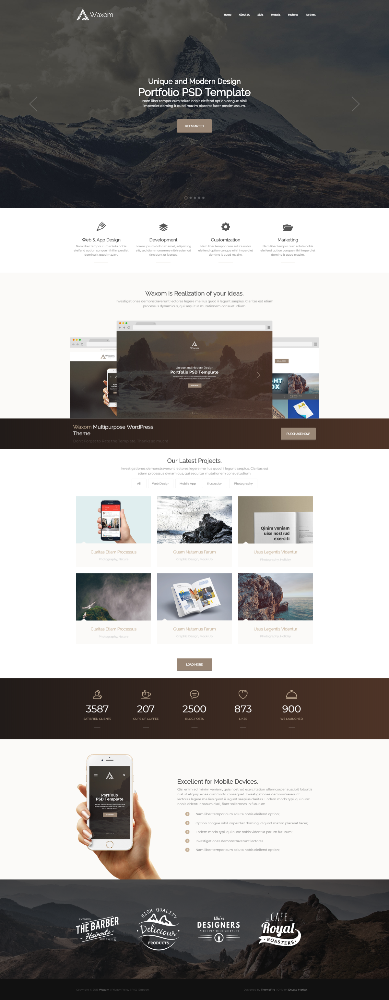
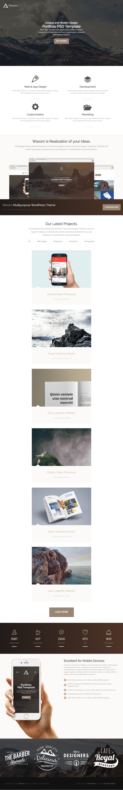
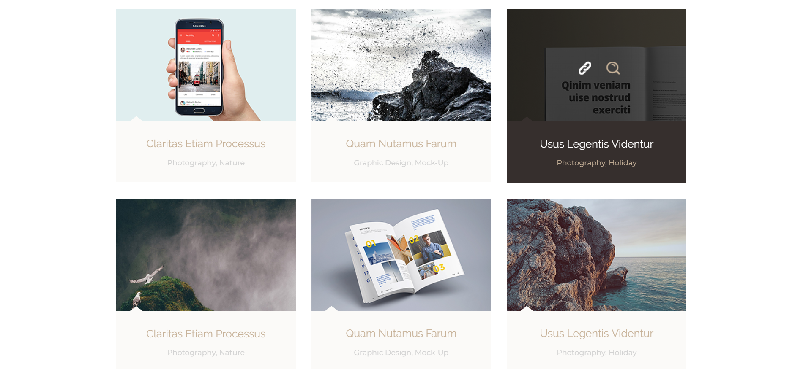

# Website_Bootstrap_jQuery
This website is based on a psd template which i received as a test task. It is responsive and adaptive on screen sizes from 320px to 1920px and bigger screens.  
It has counters section which represents numbers as counters, other section have hover effects.  
Made using HTML, CSS, Bootstrap,  JS(jQuery). 
The projects section has tabs with tags for pictures, when user chooses one of these tabs, only pictures that represent its tags are shown.

This is a responsive website that includes various sections, Bootstrap carousel, counters and other elements with hover effects.
 
 
 
 
Lg screens
 
 

 
Md screens
 
 

 
 
Sm screens
 
 

 
For extra small devices 
 
 

 
 
Projects section on hover
 
 

 
